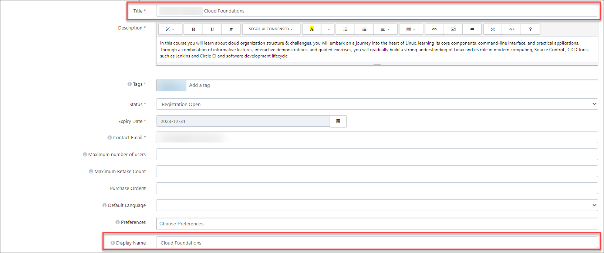
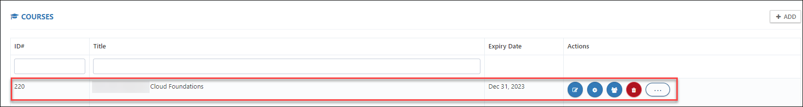
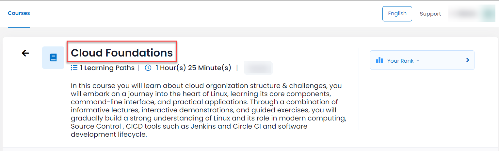

# Best Practices for Azure Templates

## 1. Naming Conventions for the CloudLabs

### A. Naming Conventions for the Templates
   
   * While adding the template name we need to ensure that we are following the best practice like which Course/lab and other parmeters which is easy to identify the template..
   
     

### B. Naming Conventions for the ODL

   * ODL Name: Give a preferred name for your ODL that will help you to identify the labs in the listed ODLs. **For example: While naming the On Demand Lab, use the following pattern (Lab_Name + Venue Location + Date). This way you can quickly identify the ODLs at ease and will reduce confusion.**

### C. Naming Conventions for the Course

   * Course Name: Course is basically combination of multiple learning components such as a labs, Knowledge Assessments, Videos, Documents. So give the name that which is easy to identify.

      (**Note: Course Title will be visible in the Course Tab as below which is will not be visible to users Display Name Which will be visible to users**)
      
      
      

      
   

## 2. CloudLabs Parameter
   CloudLabs parameters can be used while creation of the cloudlabs template, which will helps us to fetch the values from the cloud.
   
below are some of the cloudlabs parameter that can be used.

| **Parameter** | **Remarks** |
| ------------- | ----------- |
| GEN-PASSWORD  | Generates a random password of 12 characters.|
| GEN-UNIQUE    | Generates a GUID of 18 characters starting with 'cs'. |
| GEN-UNIQUE-[Length] | Generates a GUID of [Length] characters starting with 'cs'. |
| GEN-UNIQUE-NUM-[Limit] | Generates a random number with upper limit [Limit]. |
| GEN-SSH-PUB-KEY | Generates SSH Public Key. |
| GEN-GUID | Generates a GUID. |
| GET-ENV-[Length] | Gets Environment variable. |
| CONFIG_STORAGE_ACCOUNT_NAME | Gets Azure Functions storage account name. |
| GET-SERVICEPRINCIPAL-NAME | Gets SP display name. |
| GET-SERVICEPRINCIPAL-SECRET | Gets SP secret key. |
| GET-SERVICEPRINCIPAL-APPLICATION-ID | Gets SP Application Id. |
| GET-SERVICEPRINCIPAL-OBJECT-ID | Gets SP Application Object Id.|
| GET-SERVICEPRINCIPAL-SPOBJECT-ID | Gets SP Object Id.|
| GET-AZUSER-UPN | Gets Azure AD user email. |
| GET-AZUSER-PASSWORD | Gets Azure AD user password. |
| GET-PARAMETER-FILE-BASEURI | Gets Parameter file base URI.
| GET-TEMPLATE-FILE-BASEURI | Gets Template file base URI. |
| GET-AZUSER-OBJECTID | Gets Azure AD user object Id. |
| GET-DEPLOYMENT-ID | Gets CloudLabs deployment Id.
 | GET-TENANT-FQDN | Gets Azure AD domain. |
| GET-LAUNCH-TYPE | Cloud labs deployment type used to tags|
| GET-TEMPLATE-ID | Cloud labs deployment related template Id |
| GET-TENANT-ID | Cloud labs deployment related Tenant Id |
| GET-SERVICEPRINCIPAL-APPLICATION-ID | Gets the AWS Access Key for accessing the AWS Console through CLI (Command Line Interface) |
| GET-SERVICEPRINCIPAL-SECRET | Gets the AWS Secret Key for accessing the AWS Console through CLI (Command Line Interface) |

## 3. How to define the Parmeter and Variables.

 **Parmeters**: In the parameters section of the template, you specify which values you can input while deploying the resources.

 

 **Parameter file**: Rather than passing parameters as inline values in your ARM Template, you can use a JSON file that contains the parameter values. The parameter names in the parameter section of your ARM template and Parameter file must match.

 Find the below is an ARM Template sample: https://cloudlabsai.blob.core.windows.net/sample-templates/deploy-arm-01.json

 **Variables** - In the variables section, you construct values that can be used throughout your template. You don't need to define variables, but they often simplify your template by reducing complex expressions.

 

 

       
