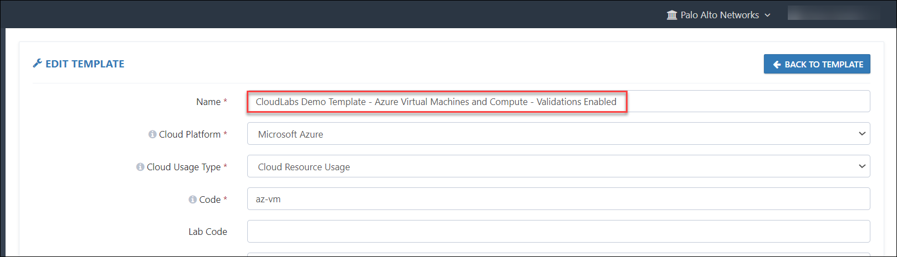
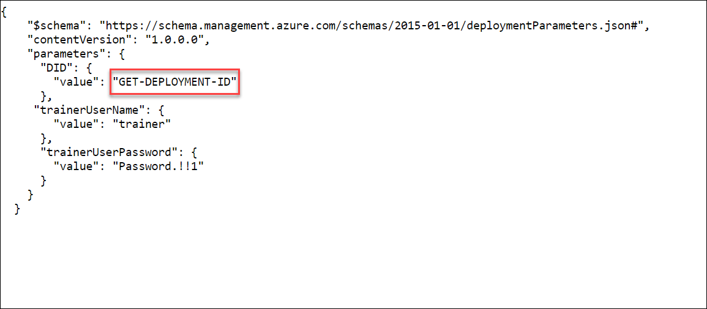
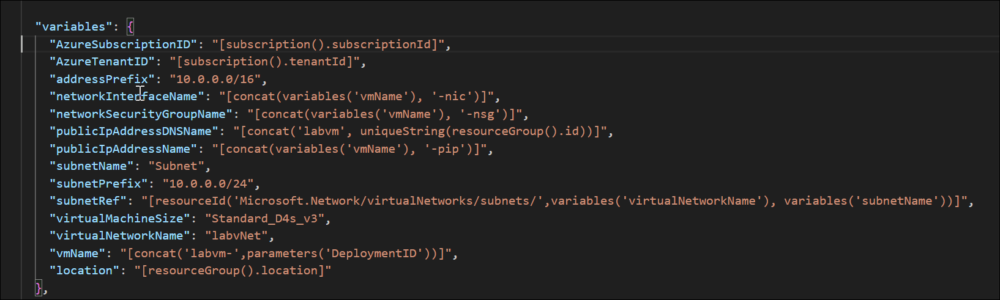

# Best Practices for Azure Templates
## 1. Naming Conventions for the Templates
   While adding the template name we need to ensure that we are following the best practice like which Cource/lab and other parmeters which is easy to identify the template.
 

   

## 2. CloudLabs Parameter
   CloudLabs parameters can be used while creation of the cloudlabs template, which will helps us to fetch the values from the cloud.
   
below are some of the cloudlabs parameter that can be used.

| **Parameter** | **Remarks** |
| ------------- | ----------- |
| GEN-PASSWORD  | Generates a random password of 12 characters.|
| GEN-UNIQUE    | Generates a GUID of 18 characters starting with 'cs'. |
| GEN-UNIQUE-[Length] | Generates a GUID of [Length] characters starting with 'cs'. |
| GEN-UNIQUE-NUM-[Limit] | Generates a random number with upper limit [Limit]. |
| GEN-SSH-PUB-KEY | Generates SSH Public Key. |
| GEN-GUID | Generates a GUID. |
| GET-ENV-[Length] | Gets Environment variable. |
| CONFIG_STORAGE_ACCOUNT_NAME | Gets Azure Functions storage account name. |
| GET-SERVICEPRINCIPAL-NAME | Gets SP display name. |
| GET-SERVICEPRINCIPAL-SECRET | Gets SP secret key. |
| GET-SERVICEPRINCIPAL-APPLICATION-ID | Gets SP Application Id. |
| GET-SERVICEPRINCIPAL-OBJECT-ID | Gets SP Application Object Id.|
| GET-SERVICEPRINCIPAL-SPOBJECT-ID | Gets SP Object Id.|
| GET-AZUSER-UPN | Gets Azure AD user email. |
| GET-AZUSER-PASSWORD | Gets Azure AD user password. |
| GET-PARAMETER-FILE-BASEURI | Gets Parameter file base URI.
| GET-TEMPLATE-FILE-BASEURI | Gets Template file base URI. |
| GET-AZUSER-OBJECTID | Gets Azure AD user object Id. |
| GET-DEPLOYMENT-ID | Gets CloudLabs deployment Id.
 | GET-TENANT-FQDN | Gets Azure AD domain. |
| GET-LAUNCH-TYPE | Cloud labs deployment type used to tags|
| GET-TEMPLATE-ID | Cloud labs deployment related template Id |
| GET-TENANT-ID | Cloud labs deployment related Tenant Id |
| GET-SERVICEPRINCIPAL-APPLICATION-ID | Gets the AWS Access Key for accessing the AWS Console through CLI (Command Line Interface) |
| GET-SERVICEPRINCIPAL-SECRET | Gets the AWS Secret Key for accessing the AWS Console through CLI (Command Line Interface) |

## 3. How to define the Parmeter and Variables.

 **Parmeters**: In the parameters section of the template, you specify which values you can input while deploying the resources.

 

 **Parameter file**: Rather than passing parameters as inline values in your ARM Template, you can use a JSON file that contains the parameter values. The parameter names in the parameter section of your ARM template and Parameter file must match.

 Find the below is an ARM Template sample: https://cloudlabsai.blob.core.windows.net/sample-templates/deploy-arm-01.json

 **Variables** - In the variables section, you construct values that can be used throughout your template. You don't need to define variables, but they often simplify your template by reducing complex expressions.

 

## 4. Concatenating Deployment ID in resources.
  
As a standard practice when we define any resources in the CloudLabs Template we need to concatenate the deployment ID with a resource. The deployment ID (DID) is a unique identification for each deployment that gets assigned to a user. For an example if we want to define a VM in the CloudLabs Template or in the ARM/CFT Template we would name it as- VM Name: VM-{GET-DEPLOYMENT-ID}, let's suppose the DID is 1009234 then the VM name would appear as VM-1009234. This helps us to uniquely identify the resource & perform any troubleshooting in-case we face any issues.

In AWS as well while naming the resources in a CloudFormation Template we can associate the DID with the resource which helps us in identifying the resource, here is an example:

            "S3Bucket": {
            "Type": "AWS::S3::Bucket",
            "Properties": {
                "BucketName": {
                    "Fn::Join": [
                        "",
                        [
                            "s3storage",
                            {
                                "Ref": "CloudLabsDeploymentID"
                            }
                        ]
                    ]
                }
            }
        }

## 5. CloudLabs Supported File Format
  
In CloudLabs the supported file format is JSON(Java Script Object Notation), below given are the resources where it is applicable:

* **Azure Resource Manager/ Cloud Formation Template:** ARM/CFT template are an IAAC (Infrastructure-As-A-Code) deployment tools where we can pre-create a set of resources & provide it to the users.
   
    While setting up CloudLabs Template, we are required to provide URL's for the ARM Template file & the Parameter file. A Parameter file is a JSON file which contains the parameter values for the Parameters defined in the ARM template, which reduces our efforts of passing parameters as inline values in the ARM template. The best practices here to follow are:

    * The ARM Template & the Parameter file must be saved in the **Azure Blob Storage**.
    
    * The ARM Template needs to be saved as **.json** while the Parameter file needs to be saved as **.parameter.json**.
    
    * Both the files must have public access enabled.

    For a detailed explanation on adding an Azure Template follow this link **[Adding An Azure Template](https://dev-cl-docs.azurewebsites.net/LabDeveloper/AddingAzureTemplate)**

    While setting up the CloudLabs Template, we are required to provide URL's for the CFT & the Parameter file. A Parameter file is a JSON file which contains the parameter values for the Parameters defined in the ARM template, which reduces our efforts of passing parameters as inline values in the ARM template. The best practices here to follow are:
   
    * The CFT & the Parameter file must be saved in the **S3 Storage Bucket**.
    
    * The CFT must be saved as **.json** while the Parameter file must be saved as **.parameter.json**.
    
    * Both the files must have public access enabled.

    In some cases when we are creating an IAM Role through CFT, there is compulsory step to acknowledge the creation of the Role while deploying the template. To overcome this issue we need to provide a parameter value in the Parameter file such that the acknowledgment is taken care & the stack deploys without any issues, here is sample how we can specify this in the Parameter file:

        {

            "$schema":"",

            "contentVersion": "1.0.0.0",

            "parameters": {

            "CloudLabsDeploymentID": {

            "value": "GET-DEPLOYMENT-ID"

         },

            "CheckAcknowledgement": {
            "value": "TRUE"
        }

    }

}

For a detailed explanation on adding an AWS Template follow this link **[Adding An AWS Template](https://dev-cl-docs.azurewebsites.net/LabDeveloper/AddingAWSTemplate)**

## 6. Adding Course Catalog

Adding courses is a part of setting up course catalog. CloudLabs course is a collection of ODL packages in a proper flow, so you must create the required templates and ODLs for your labs, assessments, and videos prior to creating the course. While we create a configuration for the course following points are to be followed:
     
   * type: While setting up the course we must clearly state the type of the component whether it is a **learning path, lab, lecture, document, or a practice test**.
     
   * number of children: If there are any sub-components of a course & module then we need to specify the number of count.

   * clid: This is the unique On-Demand Lab (ODL) ID with which you want to associate with the course. To elaborate if we have multiple modules under a course, then we would to set-up different ODL's for each module, where we would have different clid corresponding to each ODL & that ID must be specified when we are configuring modules for a course.

   Here is the format for adding a course component:

         {
            "uid": "enter-a-uid-for-this-component",  //You can create an ID to uniquely identify this component in course 
            "type": "<enter the component type here>",
            "title": null,
            "url": "<enter the URL for a lab-guide, help document or a video>",
            "icon_url": "<paste the ICON URL saved in a PNG or SVG format>",
            "duration_in_minutes":"<enter the duration of module in minutes>",
            "number_of_children": "<enter the sub-components of a module, if applicable>,
            "clid": <enter your ODL CLID>", // Change this with CLID of your lab ODL. 
            "description": null,
         }
           
     Sample configuration for defining a Lab course component:

        {
            "uid": "AWS-Introduction", 
            "type": "lab",
            "title": null,
            "url": "https://www.example.com/",
            "icon_url": "https://cloudlabsai.blob.core.windows.net/icons/hands_on_lab.svg",
            "duration_in_minutes":"120",
            "number_of_children": "0",
            "clid": "b8868270-ea8c-47d8-ac39-fedaed42c5eb", 
            "description": null,
         }

For a detailed explanation on Course set-up follow this link: **[Creating CloudLabs Course](https://docs.cloudlabs.ai/LabDeveloper/AddingCourses)**

## 7. TEMPLATE PERMISSIONS

1. **Permission/Role Type:** Here we have three types of Permissions –

   * **Azure**:
     * **Azure Built-in Role**: Roles that are available in Azure itself.
     * **Azure Custom Role**: If the Azure built-in roles don't meet the specific needs of your lab, you can create your own custom roles.
     * **Custom ARM Policy**: Here, you can restrict the resources/services by specifying the custom permission URL based on your needs.
   * **AWS**:
     * **IAM Built-in Policy**: It provides an option to attach AWS Managed permissions to the users.
     * **IAM Custom Policy**: If we want to provide restricted access to AWS services to users, then we can select this option.
     * **IAM Instructor Access**: This option can be used to provide access to instructors.
   * **GCP**:
     * **Basic Role**: Basic roles are highly permissive roles that existed prior to the introduction of IAM. You can use basic roles to grant principals broad access to Google Cloud resources.
     * **Custom Role**: If we want to provide restricted access to GCP services to users, then we can select this option.

   ***NOTE***: While developing a new lab (dev - phase), you can grant Owner (Azure/GCP) or Administrator access (AWS) for the user, so that there are no conflicts/errors while deploying any kind of resources and once the lab development is completed, you can build custom policies based on the lab requirements so that the users cannot deploy anything besides the lab guide.

2. **Profile Type:**

   * **Attendee**: Select this option if you want to assign permission to a User.
   * **Instructor (Not Applicable for GCP)**: Select this option if you want to assign permission to an Instructor/Mentor/Proctor.
   * **Group Member**: Select this option if you want to assign permission to a user who is an Azure Active Directory Group Member.

## 8. VM CONFIGURATION – ONLY APPLICABLE FOR AZURE:

Under **Add VM Configuration**, add following values:

1. **Name**: In this column, you must enter the exact name of your VM that you supplied in your ARM Template.

2. **Type**: Here you have to choose the Type of your virtual machine. There are two options available - RDP and SSH, so choose one based on the type of your VM.

3. **Server DNS Name**: From your ARM Template, pick up the output parameter that has the VM DNS name stored in it and paste it into this field.

4. **Server User Name**: From your ARM Template, pick up the output parameter that has the VM Username stored in it and paste it into this field.

5. **Server Password**: From your ARM Template, pick up the output parameter that has the VM Password stored in it and paste it into this field.

6. At last, click on **SUBMIT** to save the configurations.

 

       
